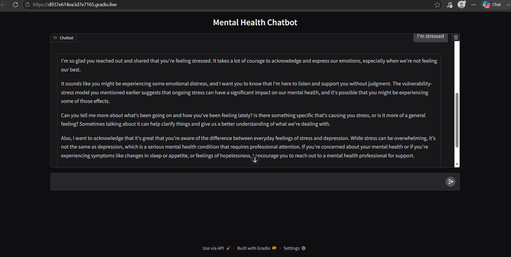

# AI-Mental-Health-Chatbot

# 🧠 AI Mental Health Chatbot (RAG System)

An AI-powered **Mental Health Chatbot** built using **Retrieval-Augmented Generation (RAG)** with LangChain, Groq LLM, and ChromaDB. The system answers mental health-related questions by retrieving relevant context from a custom PDF knowledge base before generating responses.

Instead of relying only on a large language model, this chatbot grounds its answers in **real documents**, improving accuracy and reducing hallucinations.

---

## ⚠️ Disclaimer

This project is built for **educational and research purposes only**.

It is **NOT a medical tool** and should NOT be used for diagnosis, treatment, or clinical decisions. If you are experiencing mental health issues, please consult a qualified professional.

---

# 📸 Demo

> demo



---


# ✨ Features

- 📄 Upload and process PDF knowledge base
- ✂️ Automatic document chunking (Recursive Character Text Splitter)
- 🔍 Semantic search using embeddings
- 🧠 Context-aware responses using RAG pipeline
- 🤖 Groq LLM (Llama 3.3 70B) for response generation
- 🗂️ ChromaDB vector storage
- 💬 Interactive Gradio chatbot interface
- 📊 Retrieval-based grounded answers
- ⚡ Fast inference using Groq API

---

# 🧠 How It Works

The system follows a Retrieval-Augmented Generation pipeline:

```
User Question
     │
     ▼
Query Embedding (HuggingFace MiniLM)
     │
     ▼
Vector Search (ChromaDB)
     │
     ▼
Relevant PDF Chunks Retrieved
     │
     ▼
Context + Question → Groq LLM
     │
     ▼
Final Answer (Grounded Response)
```

---

# 🔄 RAG Pipeline Breakdown

### 📄 1. Document Loading

- Load PDF files containing mental health information

---

### ✂️ 2. Text Splitting

- Split documents into smaller semantic chunks
- Uses `RecursiveCharacterTextSplitter`

---

### 🔍 3. Embedding Generation

- Convert chunks into vector embeddings
- Model: `all-MiniLM-L6-v2`

---

### 🗂️ 4. Vector Storage

- Store embeddings in **ChromaDB**
- Enables fast similarity search

---

### 🧠 5. Retrieval + Generation

- Retrieve top relevant chunks
- Pass them as context to Groq LLM
- Generate grounded response

---

# 🛠 Tech Stack

## 🤖 AI / ML

- LangChain
- Groq API (Llama 3.3 70B Versatile)
- HuggingFace Embeddings

## 📚 RAG Components

- ChromaDB (Vector Database)
- RecursiveCharacterTextSplitter
- RetrievalQA Chain

## 💬 UI

- Gradio

## 📄 Data

- PDF Knowledge Base

## 🐍 Language

- Python

---

# 📂 Project Structure

```
Mental-Health-RAG-Chatbot/
│
├── app.py (or notebook in Colab)
├── data/
│   └── mental_health_docs.pdf
│
├── vectorstore/
│   └── chroma_db/
│
├── utils/
│   ├── load_pdf.py
│   ├── chunk_text.py
│   └── embeddings.py
│
├── screenshots/
│
├── README.md
└── requirements.txt
```

---

# 🚀 Installation (Colab Version)

Since this project is built in **Google Colab**, no local setup is required.

### Step 1: Install dependencies

```python
!pip install langchain
!pip install langchain_community
!pip install langchain_groq
!pip install chromadb
!pip install sentence-transformers
!pip install gradio
```

---

### Step 2: Set API Key

```python
import os
os.environ["GROQ_API_KEY"] = "your_api_key_here"
```

---

### Step 3: Upload PDF Knowledge Base

```python
from google.colab import files
uploaded = files.upload()
```

---

### Step 4: Run the Notebook

Run all cells to:

- Load PDF
- Create embeddings
- Build vector store
- Launch chatbot UI

---

### Step 5: Launch Gradio UI

```
http://127.0.0.1:7860
```

---

# 💡 Example Usage

### User Query

```
I feel anxious and stressed all the time. What should I do?
```

### Chatbot Response (Grounded)

```
Based on the provided mental health resources, anxiety can be managed through:

• Deep breathing exercises
• Regular physical activity
• Talking to a therapist
• Practicing mindfulness

If symptoms persist, professional help is recommended.
```

---

# 🧠 Key Concepts Learned

- Retrieval-Augmented Generation (RAG)
- Vector Databases (ChromaDB)
- Embedding Models
- Semantic Search
- Prompt Engineering
- LangChain Pipelines
- Context-aware LLMs
- AI Hallucination Reduction
- Gradio Chatbot Development

---

# 🚀 Future Improvements

- 🧾 Add multiple document support
- 💬 Chat memory / conversation history
- 🌐 Web deployment (Hugging Face Spaces / Streamlit Cloud)
- 🧠 Better embedding models (e.g., BGE, OpenAI embeddings)
- 📊 Citation-based answers (show source chunks)
- 🔐 Authentication for users
- 📱 Mobile-friendly UI
- 📈 Analytics dashboard for queries
- 🗣️ Voice-based interaction

---

# 🎯 Learning Outcomes

This project helped me understand:

- How RAG systems work end-to-end
- Vector similarity search
- Embedding generation
- ChromaDB usage
- LangChain retrieval pipelines
- Reducing hallucinations in LLMs
- Building real-world AI chatbots
- Integrating LLMs with external knowledge sources

---

# ⚠️ Ethical Note

This chatbot is designed for **educational purposes only** and should not be used as a substitute for professional mental health care.

---

# 🤝 Contributing

Contributions are welcome!

1. Fork the repository
2. Create a feature branch
3. Commit changes
4. Open a Pull Request

---

# ⭐ Support

If you found this project helpful, consider giving it a ⭐ on GitHub.

---

# 👨‍💻 Author

**Sanaya Samadhi**

- GitHub: https://github.com/it21302862
- LinkedIn: https://www.linkedin.com/in/sanaya-samadhi/

---

# 📜 License

This project is licensed under the MIT License.